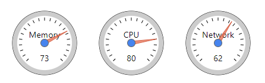

# Google-style Gauge Chart with D3



A re-creation of Google Charts's Gauge chart using D3. Only the basics are included: a label and a value.

## Installation

1. Include D3: `<script src="https://d3js.org/d3.v5.min.js"></script>`
2. Include JS: `<script src="d3-gauge-chart.js"></script>`
3. Include CSS: `<link rel="stylesheet" href="d3-gauge-chart.css">`

## Usage

1. Create a new SVG element in your HTML. Make sure it has an `id`, `width`, and `height`. For best results, make it square.

2. Call the function:

```
gaugeChart({
  el: '#chart',
  label: 'Memory',
  value: 73,
  min: 0,   // optional
  max: 100, // optional
});
```
